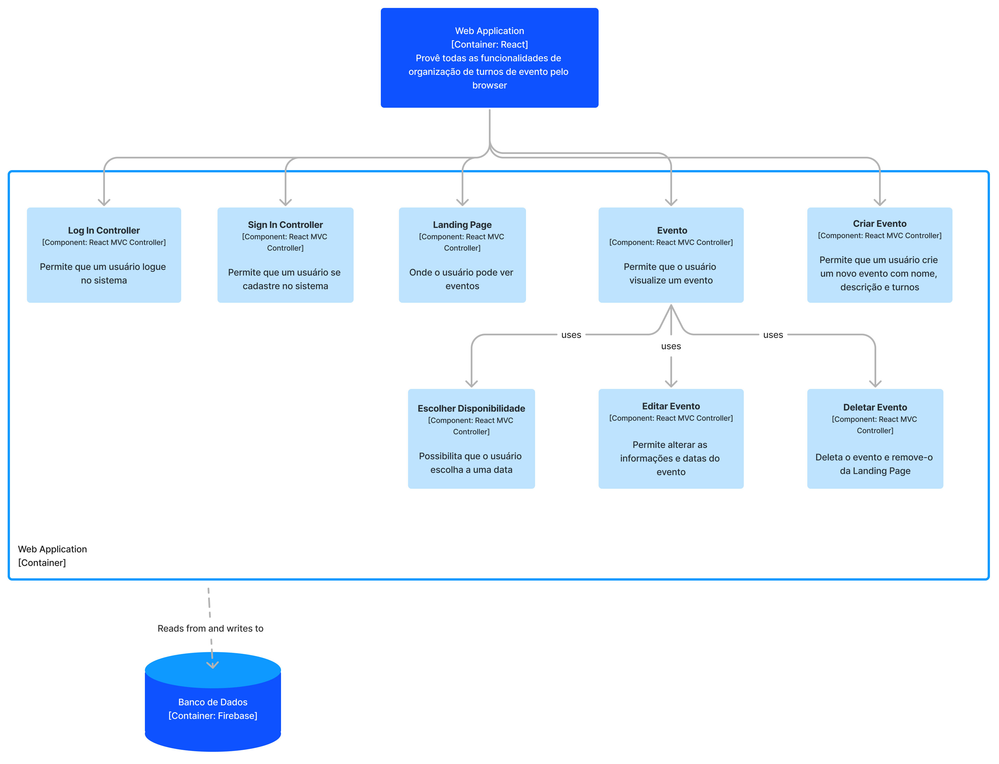

# ENGENHARIA DA PIZZA

Temos como objetivo trazer eficiência e praticidade para a organização de arrecadações de alimento para entidades de caridade. 

Neste projetos nos propomos a criar um sistema que colete disponibilidade de voluntários e trace grupos, relacionando-os com os destinos onde as coletas ocorrerão.

## Como usar
 
### Configurando o ambiente

Para executar a aplicação, é necessário instalar o gerenciador de pacotes npm. Acesse a [documentação](https://docs.npmjs.com/downloading-and-installing-node-js-and-npm) para mais detalhes.
 
Feito isso, execute os seguintes comando no Powershell ou no terminal:
 
```
git clone git@github.com:tutuzeraa/engenharia-da-pizza.git
cd engenharia-da-pizza
cd agendando_um_jeito
npm install              # instala as dependências do projeto 
```

### Executando
 
Com o ambiente configurado, basta executar o seguinte comando no terminal:
 
```
npm start
```
 
Agora o servidor deve estar funcionando, localmente, em http://localhost:3000 !

## Arquitetura


Figura 1: Diagrama C4 em nível de componentes

### Estilo Arquitetural

Para a nossa aplicação web, adotamos o estilo arquitetural  **Model-View-Controller (MVC)**, com a segregação dos componentes responsáveis por interagir com o modelo, prover a visualização e servir de intermédio entre o usuário e os serviços.


### Componentes e suas funcionalidades

O nosso projeto consiste em uma aplicação web multipáginas. No diagrama acima, está explicitado os principais componentes que atuam como controladores e que são "responsáveis" por cada página, junto de uma breve descrição de suas funções. Além deles, há sub-componentes responsáveis pela visualização e interação direta com o banco de dados, mas por clareza decidimos não incluí-los no diagrama. Esses sub-componentes são chamados dentro dos componentes principais que estão na figura. 
